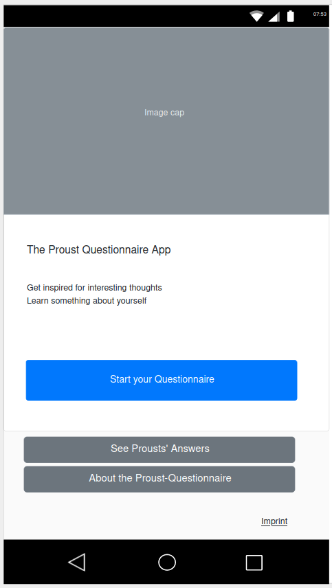
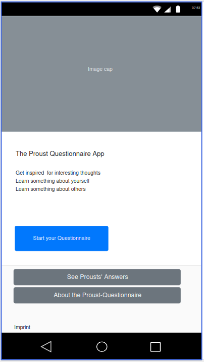

# Proust App

## Elevator Pitch

Die Proust-App möchte dich zu interessanten Gedanken und Gesprächen anregen, um dich selbst und andere besser kennen zu lernen.

## Intro

In der Vergangenheit haben auch Erwachsene das heute bei Kindern beliebte [Freunde- oder Poesiealbum](https://de.wikipedia.org/wiki/Poesiealbum) in denen persönliche Gedanken, Weiheiten, Witze und Skizzen festgehalten wurden.
In Marcel Proust Variante [Proust Questionnaire](https://en.wikipedia.org/wiki/Proust_Questionnaire) als einer Art Offenbarungs-Fragebogen um damit interessante Gedanken und Gespräche anzustossen und sich persönlich näher zu kommen.

Heutzutage ist es für viele schwierig diese Nähe über räumliche Distanzen, Lockdowns den stressigen Alltag aufrecht zu erhalten. Social Media schafft die Verbindung las kurzlebiges Statusupdate wird aber eher nicht dazu genutzt langlebigere und inspirierende Gedanken auszutauschen.

Die Proust-App möchte es erleichtern diese Gedanken zu inspirieren, festzuhalten und zu teilen und so etwas über sich selbst und andere zu erfahren.

### Links

* <https://de.wikipedia.org/wiki/Freundschaftsbuch>
* <https://de.wikipedia.org/wiki/Poesiealbum>
* <https://en.wikipedia.org/wiki/Confession_album>
* <https://en.wikipedia.org/wiki/Proust_Questionnaire>
* <https://en.wikipedia.org/wiki/Slam_book>

## Persona

Alle Leute die aufgrunf mangelnder Zeit, räumlicher Distanz, persönlicher Veranlagung _oder ähnliches etc_ etwas Unterstützung möchten um Nähe mit aufrecht zu erhalten oder Freundschaften weiterzuentwickeln.

## User Stories

### Übersicht

1. MVP \'V0.1'  
   1. Intro
   1. Fragen ansehen > Inspire
   1. Antworten eingeben > Reponse
   1. Antworten speichern > Memorise
   1. Lesezeichen > Bookmark
   1. Veröffentlichen 
1. v 0.2
   1. Personifizieren > Personify
   1. Teilen > Share
1. v X.y
   1. andere Fragebögen verwenden > Diversify
   1. einzelne Fragen schicken und Antworten mit Namen speichern > Dialogify
   1. mehrere Antwortbögen speichern > Librify
   1. eigene Fragen verwenden > Universify
   1. eigene Fragebögen verwenden > Institutionalise

### Stories

### 0. Intro

#### Story

Als potentieller Benutzer der 'ProustApp' möchte ich einen Eindruck davon erhalten worum es bei der ProustAppp geht und welche Vorteile ich von der Benutzung habe.

#### Kriterien

* zeigt ein kleines portrait Bild von Proust
* zeigt einladend den Titel der App
  * 'Willkommen zur ProustApp'
* zeigt kurz die Benefits der App
  * zu interessanten Gedanken inspirieren
  * etwas über sich selbst lernen
  * etwas über andere lernen
* link zu eigenem Dialog '/dialog/new'
* link zu Proust's Questionnaire Dialog '/dialog/1'
* Mock
  * 

### 1. Ansehen > Inspire

#### Story

Als .. möchte ich die Fragen aus Dem Proust Questionnaire lesen und damit für interessante Gedanken und Gespräche inspiriert zu werden.

#### Kriterien

* Es werden der PQ Fragebogen angezeigt
* es gibt eine Möglichkeit Prousts eigene Antworten darauf anzuzeigen

### 2. Eingeben > Response

#### Story

Als .. möchte ich Antworten zu Fragen aus dem 'Proust Questionnaire' eingeben um
mir Diese leichter zu merken und für eine Unterhaltung festzuhalten.

#### Kriterien

* Die Fragen werden aufgelistet
* Zu jeder Frage kann eine Antwort eingegeben werden

### 3. Speichern > Memorise

#### Story

Als .. möchte ich meine Antworten speichern und einfach wieder abrufen können
um für eine Unterhaltung wieder darauf zurück zu kommen oder meine Antworten
an Familie und Freunde zu schicken.

#### Kriterien

* Die Antworten zu Fragen werden mit einer guid gespeichert
* Mithilfe der guid kann über eine url das Questionnaire mit Antworten aufgerufen werden

### 4. Lesezeichen / Bookmark

#### Story

Als .. möchte ich einen/meinen Antwortenkatalog als Lesezeichen speichern um
diese zu einem späteren Zeitpunkt laufrufen zu können.

#### Kriterien

* schaltfläche mit 'Lesezeichen speichern'
* klick speichert aktuelle url als Lesezeichen im Browser

### 5. Personifizieren / Personify

#### Story

Als .. möchte ich zu den Antworten zugehörigen einen Namen eingeben um meine Antworten oder die anderer
leichter identifizieren zu können.

#### Kriterien

* zu dem Antwortkatalog kann ein Name eingegeben werden
* der Name wird mitgespeichert

### 6. Teilen / Share

#### Story

Als .. möchte ich meine Antworten leicht mit Familie und Freunde teilen können
um so leichter interessante gespräche zu initieren.

#### Kriterien

* schaltfläche mit link copy in Zwischenablage
* Schaltfläche mit share zu Apps
* aktualisiertes Intro  
* Mock
  * 

### 7. Deploy > Dockerise

#### Story

Als technischer Consultant der die App bei Kunden installieren möchte wünsche ich mir eine Möglichketi das sehr einfach auch auf Linux systemen zu erledigen.

#### Kriterien

* die App wird in einem Container bereitgestellt
* der App-Container kann im Docker Format sein
* die App kann über den Container in wenigem Minuten installiert und gestartet werden

### x. andere Fragebögen verwenden > Diversify

### x. einzelne Fragen schicken und Antworten mit Namen speichern > Dialogify

### x. mehrere Antwortbögen speichern > Librify

### x. eigene Fragen verwenden > Universify

### x. eigene Fragebögen verwenden > Institutionalise

## Technisches

1. Front-End: html, Angular.js
1. Backend: Restful-Api mit .net Core
1. Daten:  Document DB: Mongo DB
1. Deployment: Dockerfile

### Front End

#### View Index

**v0.1**

#### View Questionnaire

**v0.1**
nichts

**v x.**

* Zeigt eine Liste der verfügbaren Questionnaires
* ermöglicht detailsansicht eines ausgewählten Questionnaires

#### View Dialog

**v 0.1**

* '/new || /create': zeigt Fragen des Questionnaires und Eingabemöglichkeiten für Antworten
* '/new' Schältfläche zum speichern
* '/id/': zeigt den Dialog mit der nagegeben Id

### Backend API

#### Resource: Fragebogen (Querstionnaire)

Eigenschaften: int id, string name, List\<string> fragen

**v 0.1**

* Read / GET(int id): lädt den Fragebogen mit der zugehörigen id, bis Vx nur Proust Original

**v x.**

* Create / POST(object Querstionnaire): legt einen neuen Fragebogen an
* Update / UPDATE(object Questionnaire): aktualisiert den übergeben Fragebogen
* Delete / DELETE(int id): Löscht den Fragebogen mit der übergebenen Id
* List / GET(): lädt alle verfügbaren Fragebögen

#### Resource: Dialog (Dialog)

Eigenschaften: int id, string guid, string questionnaireId, List\<Tuple<string, string>> Fragenantworten

Dialog mit Id=1 ist bereits angelgt und zeigt den Dialog von Proust selbst

**v 0.1**

* Create / POST(object Dialog): speichert die Antworten zum Fragebogen und erzeugt einen Short-GUID String mit dem über die Get (string guid) der Dialog geladen werden kann
* Read / GET(string guid)

**v0.x**

* Delete / DELETE(int id)

**v.x**

* List / GET(int userid): Lädt alle Dialoge des Benutzers
* Read / Get(int id): lädt den Dialog mit Namen, Fragebogen, Liste der Antworten
* Update / UPDATE(object Dialog)
